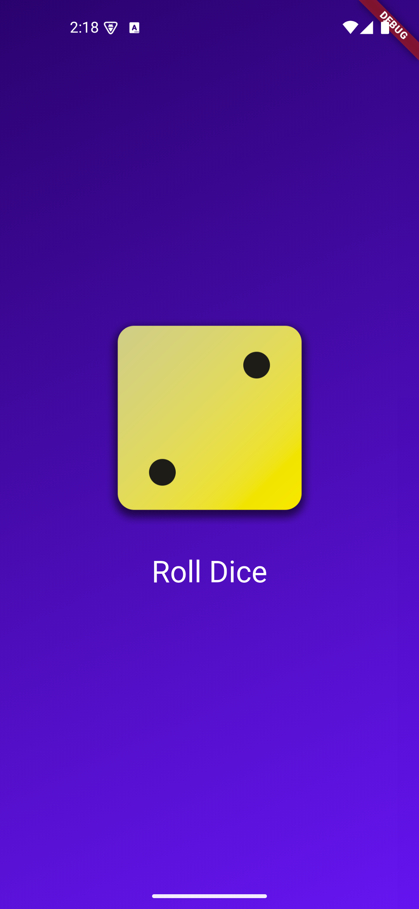
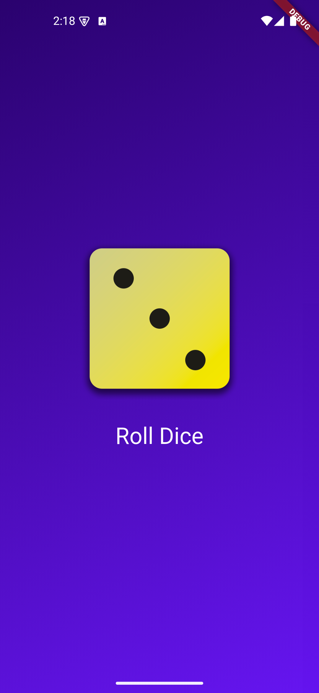
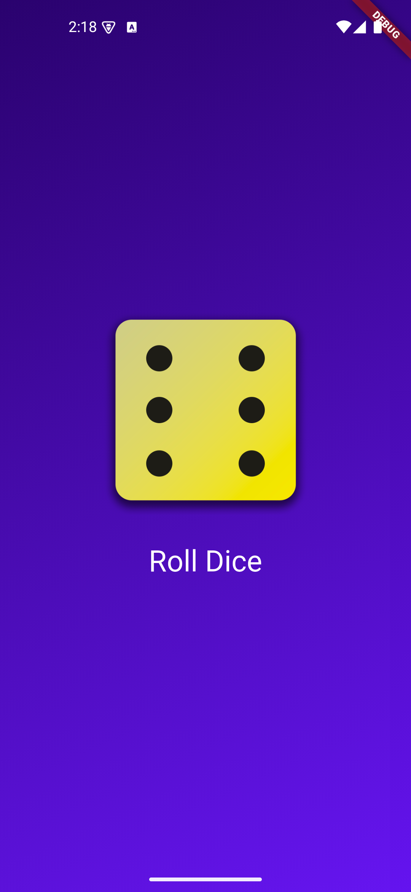

# 🎲 Dice Roller App

A **dice roller application** that simulates rolling a dice with a beautiful gradient background. Perfect for board games, decision making, or learning Flutter development.


## ✨ Features

- **Virtual Dice** – Roll a digital dice with realistic animations
- **Beautiful UI** – Enjoy a visually appealing gradient background
- **One-Touch Rolling** – Simple tap interaction to roll the dice
- **Random Results** – Get truly random dice values (1-6)
- **Responsive Design** – Works on various device sizes and orientations


## 📸 Screenshots

<p align="center">
    
    
    
</p>


## Installation

1. Clone the repository:

```sh
git clone https://github.com/your-username/dice-app.git
```

2. Navigate to the project directory:

```sh
cd dice-app
```

3. Install dependencies:

```sh
flutter pub get
```

4. Run the app:

```sh
flutter run
```


## 📁 Project Structure

```bash
lib/
├── main.dart              # Entry point of the application
├── gradient_container.dart # Creates the gradient background UI
├── dice_roller.dart       # Contains dice rolling logic
└── styled_text.dart       # Custom styled text components

